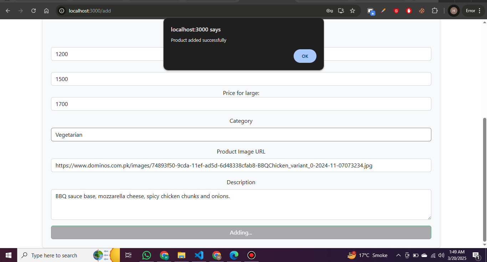
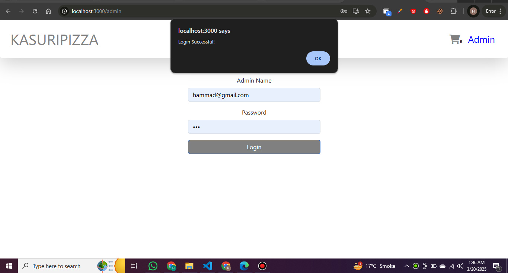
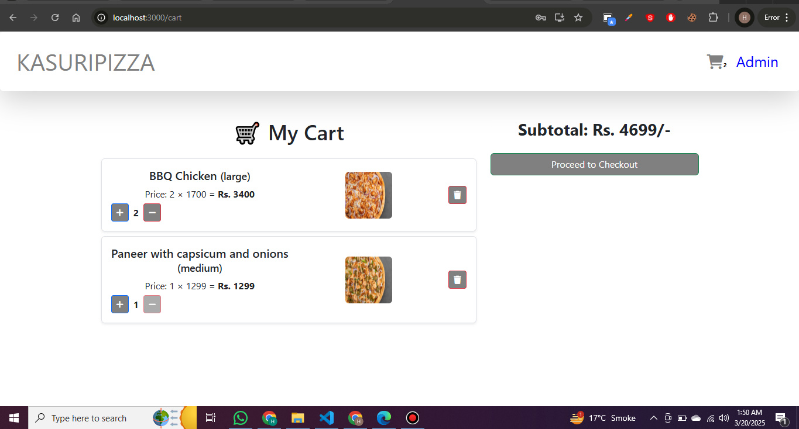
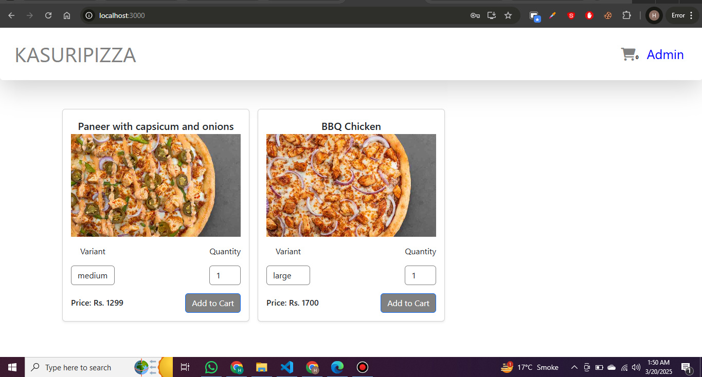
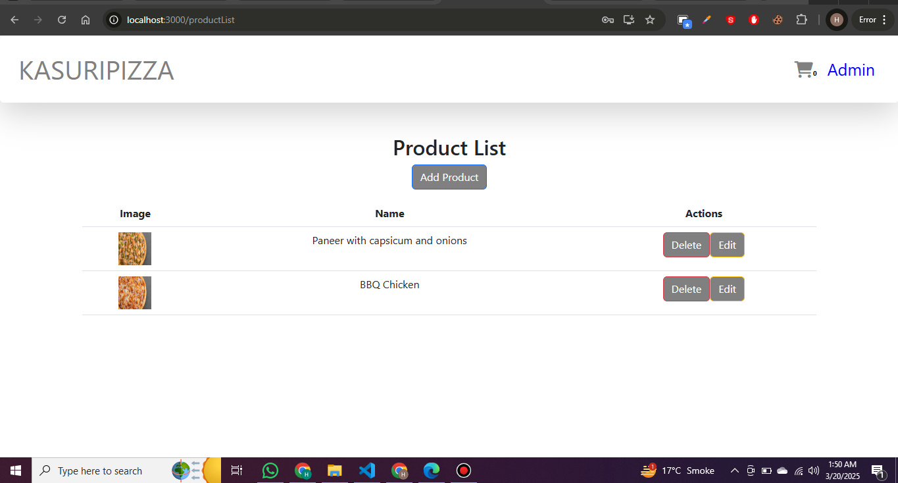
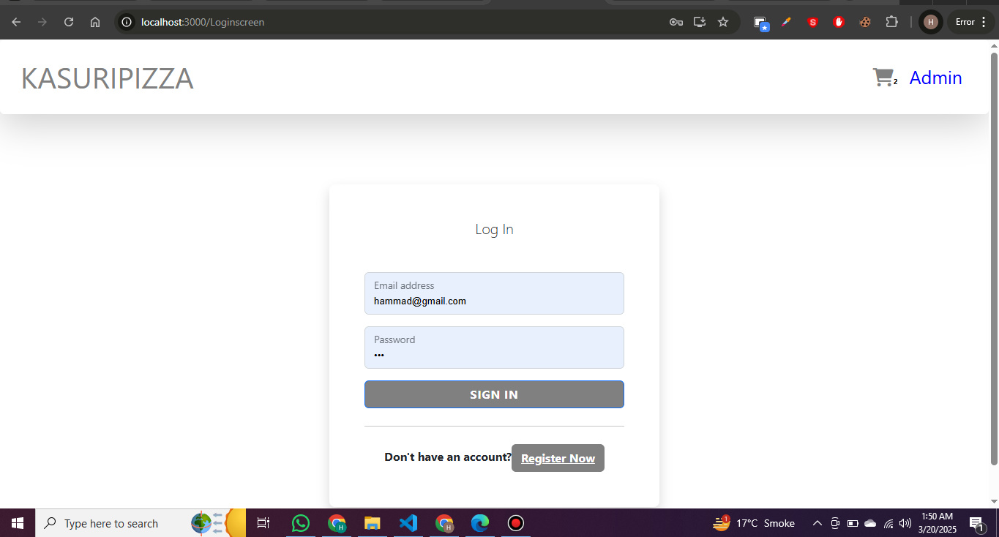

# Pizza Hub

**Deployed Link:**  
[Live Project](https://pizza-hub-six.vercel.app/)

## Screenshots

### Add Product


### Admin Login


### Cart


### Home


### Product Dashboard


### User Routes


# PizzaHub 🍕  
**A MERN Stack Pizza Ordering App**

## Table of Contents
- [Overview](#overview)
- [Features](#features)
- [Tech Stack](#tech-stack)
- [Installation](#installation)
- [Usage](#usage)
- [Contributing](#contributing)

---

## Overview  
PizzaHub is a feature-rich pizza ordering application built using the MERN stack. It provides seamless user experience, including user authentication, cart management, and an admin panel for managing products. With Redux for state management and Postman for API testing, the app is designed for efficiency and reliability.

---

## Features  
- **User Authentication**: Secure login and registration system.  
- **Dynamic Menu**: Displays a list of pizzas fetched from the backend.  
- **Cart Management**: Add/remove items with real-time updates using Redux.  
- **Admin Panel**: Manage product lists, add/edit products.  
- **Responsive Design**: Fully responsive for all devices.  
- **Secure Backend**: RESTful APIs tested with Postman.  

---

## Tech Stack  
### Frontend:  
- React.js  
- Redux  
- React Router  
- Bootstrap  

### Backend:  
- Node.js  
- Express.js  
- MongoDB (Mongoose)  

### Other Tools:  
- Postman  
- bcrypt.js (password hashing)  
- JSON Web Token (JWT)  

---

## Installation  

1. Clone the repository:  
   ```bash
   git clone https://github.com/your-username/mern-pizza-app.git
   cd mern-pizza-app
   ```

2. Install frontend dependencies:  
   ```bash
   cd client
   npm install
   ```

3. Install backend dependencies:  
   ```bash
   cd ../server
   npm install
   ```

4. Set up environment variables:  
   Create a `.env` file in the `server` directory and add the following variables:  
   ```env
   MONGO_URI=your_mongo_database_url
   JWT_SECRET=your_secret_key
   ```

5. Run the app:  
   - Start the backend server:  
     ```bash
     cd server
     npm start
     ```
   - Start the frontend server:  
     ```bash
     cd client
     npm start
     ```


## Usage  

### Available Pages  
- `/` - Home Page  
- `/admin` - Admin Panel  
- `/productList` - List of Products  
- `/add` - Add New Product  
- `/edit` - Edit Existing Product  
- `/cart` - Cart Page  
- `/Registerscreen` - Registration Page  
- `/About` - About Page  

---

## Contributing  
Pull requests are welcome! For major changes, please open an issue first to discuss what you would like to change.

---

